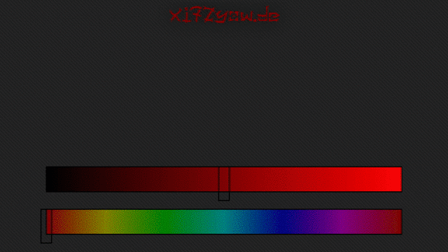

# WS2812B-ESP-Webserver
Control your NeoPixels over a network.

# Actual UI:

# To-Do:

- multithead on ESP (https://learn.adafruit.com/multi-tasking-the-arduino-part-1/ditch-the-delay)
- UI-buttons for fancy lighteffects
- manage multiple clients
- serve current setup to clients and set the page
- change from SPIFFS to LittleFS
